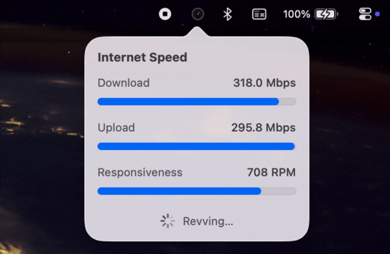

# LeanSpeedo

A tiny macOS menu-bar internet speed checker. No windows, no Dock icon — just a
speedometer in the menu bar that runs Apple's built-in `networkQuality` tool and
animates the result.

<p align="center">
  
</p>

- **Download / Upload** capacity (Mbps)
- **Responsiveness** (RPM — round-trips per minute, higher is better)
- Live bars that fill during the test, driven by `networkQuality`'s streaming output
- Starts a test automatically when you open the panel; re-opens itself when a
  test finishes while closed
- Global shortcut **⌃⌥⌘R** runs a test from anywhere
- Right-click the menu bar icon for a quick menu (test, launch at login, quit)
- Last result shown as a tooltip on the menu bar icon
- Clear errors when a test fails, with the full log one click away

## Install

### Homebrew (recommended)

```bash
brew install --cask rabacadabra/tap/leanspeedo
```

The app is ad-hoc signed, not notarized (notarization needs a paid Apple
Developer account). The cask clears the download quarantine flag on install, so
it launches normally.

### Manual

Download `LeanSpeedo.dmg` from the [latest release](https://github.com/rabacadabra/LeanSpeedo/releases/latest),
open it, and drag **LeanSpeedo** to Applications.

On first launch macOS will say it "cannot verify the developer". Either open
**System Settings → Privacy & Security**, scroll down, and click **Open Anyway**,
or run:

```bash
xattr -dr com.apple.quarantine /Applications/LeanSpeedo.app
```

This is a one-time step.

## Requirements

- macOS 14 (Sonoma) or later
- `networkQuality` ships with macOS 12+, so it's always present

## How it works

macOS's `networkQuality` only prints its live progress line when it has a
terminal, so LeanSpeedo runs it through `/usr/bin/script` to give it a
pseudo-terminal, then parses the streamed `Downlink: … Mbps` lines for the
animated bars. The final `==== SUMMARY ====` block provides the authoritative
numbers. The app is **not sandboxed** (it has to spawn a subprocess), which is
also why it can't ship on the Mac App Store.

## Contributing

Building from source and the release process are documented in
[CONTRIBUTING.md](CONTRIBUTING.md).

## License

MIT — see [LICENSE](LICENSE).
